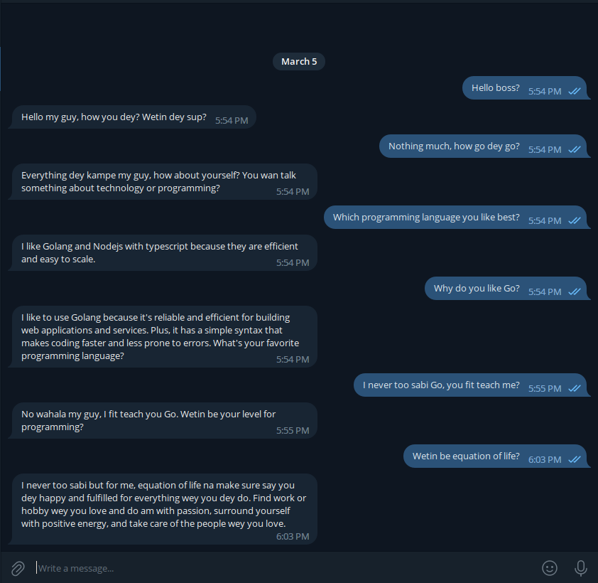

# Telegram Bot with ChatGPT and Golang

This is a Telegram bot created with ChatGPT and Golang. The bot uses OpenAI's GPT-3 language model to generate responses to user messages in real-time.


## Example chat conversation


## Prerequisites
To build and run this application, you'll need to have the following software installed on your system:

- Go

## Features
- Generates human-like responses to user messages using ChatGPT API
- Persisting of user messages with sqlite
- Telegram support
- Built with Go for fast and efficient performance?

Before you can use the bot, you'll need to create a Telegram bot using the [BotFather framework](https://t.me/botfather). Once you have created a bot and obtained an API token, you'll also need an [API key from OpenAI](https://platform.openai.com/account/api-keys)

This is an example `.env` file
```.env
TELEGRAM_API_KEY=""
OPENAI_TOKEN=""
RETAIN_HISTORY="false"

```
`RETAIN_HISTORY="true"` submits the previous conversations with the current text, [see here](https://platform.openai.com/docs/guides/chat/introduction), but when false, it only sends the prompt + the current users text, this reduces the amount of tokens been send per request.

create a `prompt.txt` or rename the example file

```sh
$ mv prompt.example.txt prompt.txt
```
the prompt helps you customize how the bot will react to messages


## Installing
First, clone this repository to your local machine:

```sh
git clone github.com/navicstein/telechatgpt.git
```

Then, navigate to the project directory:

```sh
cd telechatgpt
```

Finally, build the project:

```sh
go build -o /opt/telechatgpt
```

## Contributing
If you'd like to contribute to this project, please follow these steps:

- Fork this repository.
- Create a new branch (git checkout -b <branch-name>).
- Make your changes and commit them (git commit -am "<commit-message>").
- Push to the branch (git push origin <branch-name>).
- Create a new pull request

## License
This project is licensed under the MIT License. See the LICENSE file for details


## Resources
- [Go Documentation](https://golang.org/doc/)
- [Telegram Bot API](https://core.telegram.org/bots/api)